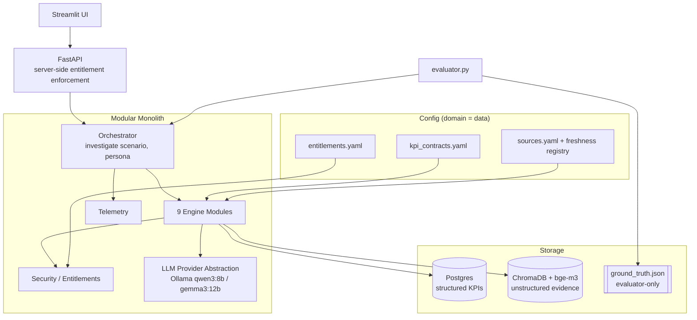

# Design Document: BusinessIntelligence.ai

## Overview

BusinessIntelligence.ai is a domain-agnostic, evidence-backed KPI decision engine. Given a business scenario (a KPI movement) and a persona (CFO / Analyst / Manager), it runs a nine-engine pipeline that detects the anomaly, decomposes it across dimensions, gathers only entitlement-authorized evidence, proposes competing hypotheses with an LLM, scores them **deterministically**, and recommends (or abstains from) an action. Every output carries a method tag, and no quantitative value is ever produced by the LLM.

The system is a **modular monolith**: nine engine modules plus one orchestrator, backed by Postgres (structured) and ChromaDB (unstructured, `bge-m3` embeddings). The domain is a configuration artifact — swapping the KPI semantic contract (`kpi_contracts.yaml`), entitlements, and sources re-targets the identical pipeline to any industry. The MVP demonstrates on retail via scenario INC_001 (checkout/payment degradation).

Correctness is not asserted by fluency. A separate `evaluator.py` reads a hidden `ground_truth.json` (never touched by the pipeline) and scores the run across 15 dimensions, including hallucinated-evidence detection, confidence correctness, and authorization violations. This design covers both the high-level architecture (system diagrams, component boundaries, data models, engine flow) and the low-level contracts (engine I/O dataclasses, deterministic confidence math, key function signatures).

---

## Architecture

### System Context



### Pipeline Flow (nine engines + entitlement boundary)

```mermaid
graph LR
    S[scenario + persona] --> E1[E1 KPI Store<br/>SQL]
    E1 --> E2[E2 Signal<br/>STATS]
    E2 --> E3[E3 Diagnostic<br/>SQL+STATS]
    E3 --> BND{{Entitlement<br/>boundary}}
    BND --> E4[E4 Evidence<br/>SQL+RETRIEVAL]
    E4 --> E5[E5 Hypothesis<br/>LLM - no numbers]
    E5 --> E6[E6 Challenge<br/>RULES - all math]
    E6 --> E7[E7 Decision<br/>LLM - consumes conf.]
    E7 --> E8[E8 Outcome<br/>SIMULATED]
    E8 --> E9[E9 Memory<br/>RETRIEVAL+LLM]
    E9 --> R[InvestigationResult]
```



### Design Rationale

- **Deterministic core, generative edge.** All numbers (KPI calc, anomaly stats, dimensional contribution, freshness, confidence, abstention) come from SQL/STATS/RULES engines. The LLM only proposes hypotheses, summarizes evidence, and writes persona narrative. This is what makes confidence reproducible across runs and defensible under evaluation.
- **Entitlement boundary before evidence.** The security check happens *before* Engine 4 assembles evidence, so unauthorized data never enters the LLM context — enforcement is server-side (FastAPI + orchestrator), not UI-side.
- **Freshness is first-class, not a footnote.** A `SourceRegistry` tracks grain, cadence, `last_refresh`, SLA, and data quality; stale-beyond-SLA sources have their reliability weight decayed, which flows directly into the confidence math. INC_001's marketing source is intentionally stale to prove this weakens the competitor hypothesis (H2).
- **Persona is a presentation lens, not an analysis fork.** The same quantitative pipeline runs for every persona; only accessible fields and narrative framing differ.

---

## Components and Interfaces

| Module | Method Tag(s) | Owns | LLM? |
|---|---|---|---|
| `engines/kpi_store.py` | `[SQL]` | Connected KPI values + freshness surface | No |
| `engines/signal.py` | `[STATS]` | Anomaly detection, corroboration, sparse/data-quality guards | No |
| `engines/diagnostic.py` | `[SQL]`+`[STATS]` | region × channel × device decomposition | No |
| `security/entitlements.py` | `[RULES]` | role → authorized data/evidence | No |
| `engines/evidence.py` | `[SQL]`+`[RETRIEVAL]` | authorized + freshness-weighted evidence | No |
| `engines/hypothesis.py` | `[LLM]` | hypothesis statements + evidence IDs (NO numbers) | Yes |
| `engines/challenge.py` | `[RULES]`+`[LLM_NARRATIVE]` | ALL confidence math + abstention | Math: No |
| `engines/decision.py` | `[LLM]` | recommended action; abstain → no actions | Yes |
| `engines/outcome.py` | `[SIMULATED]` | labeled replay, never causal proof | No |
| `engines/memory.py` | `[RETRIEVAL]`+`[LLM]` | precedent store/retrieve | Retrieval + narrative |
| `pipeline/investigate.py` | orchestrator | thread telemetry + persona + security | No |
| `llm/provider.py` | abstraction | Ollama today; swap to cloud later | — |
| `evaluation/evaluator.py` | `[RULES]` | 15-dimension scorecard vs hidden truth | No |

---

## Data Models

All models are Python dataclasses. Every engine output embeds a `MethodTag` (or list) so provenance is inspectable end-to-end. Since no programming language other than Python is specified in the plan, all code is Python.

```python
from dataclasses import dataclass, field
from enum import Enum
from typing import Optional
from datetime import datetime


class MethodTag(str, Enum):
    SQL = "SQL"
    STATS = "STATS"
    ETL = "ETL"
    RULES = "RULES"
    RETRIEVAL = "RETRIEVAL"
    LLM = "LLM"
    LLM_NARRATIVE = "LLM_NARRATIVE"
    RULES_LLM_NARRATIVE = "RULES+LLM_NARRATIVE"
    SIMULATED = "SIMULATED"


class Persona(str, Enum):
    CFO = "cfo"
    ANALYST = "analyst"
    MANAGER = "manager"


class FreshnessStatus(str, Enum):
    FRESH = "fresh"            # within SLA
    STALE = "stale"           # beyond SLA
    UNKNOWN = "unknown"


class ConfidenceState(str, Enum):
    HIGH = "high"
    MEDIUM = "medium"
    LOW = "low"
    ABSTAIN = "abstain"


class RuleVerdict(str, Enum):
    PASS = "pass"
    PARTIAL = "partial"
    FAIL = "fail"


class OutcomeType(str, Enum):
    OBSERVED = "observed"       # from real/replayed data
    SIMULATED = "simulated"     # projected, never causal proof


@dataclass
class SourceRegistryEntry:
    source_id: str
    name: str
    grain: str                  # e.g. "hourly", "15-min", "daily"
    cadence_minutes: int
    last_refresh: datetime
    sla_minutes: int            # max allowed staleness
    freshness_status: FreshnessStatus
    data_quality: float         # 0..1
    lineage: list[str]          # upstream table/file references
    owner: str

    @property
    def staleness_minutes(self) -> int: ...
    @property
    def is_within_sla(self) -> bool: ...


@dataclass
class KPIValue:
    kpi_id: str
    name: str
    value: float
    unit: str
    period: str
    dimension_filters: dict[str, str] = field(default_factory=dict)
    source_id: str = ""
    freshness: Optional[FreshnessStatus] = None
    method: MethodTag = MethodTag.SQL


@dataclass
class AnomalySignal:
    kpi_id: str
    observed: float
    expected: float
    delta_pct: float
    z_score: float
    is_anomaly: bool
    corroborated_by: list[str]          # other kpi_ids confirming
    sparse_history: bool                 # guard flag
    data_quality_suspect: bool           # guard flag (false anomaly)
    method: MethodTag = MethodTag.STATS


@dataclass
class DimensionContribution:
    dimension: str                       # "device" | "region" | "channel"
    segment: str                         # "android" | ...
    contribution_pct: float              # share of total movement
    segment_delta_pct: float
    method: MethodTag = MethodTag.SQL


@dataclass
class Evidence:
    evidence_id: str
    kind: str                            # "structured" | "unstructured"
    summary: str
    source_id: str
    reliability_weight: float            # 0..1, freshness-decayed
    relevance: float                     # 0..1, retrieval score
    raw_ref: str                         # table row / doc chunk id
    method: MethodTag                    # SQL or RETRIEVAL


@dataclass
class Hypothesis:
    hypothesis_id: str                   # "H1"
    statement: str                       # LLM prose, NO numbers-as-truth
    supporting_evidence_ids: list[str]
    contradictory_evidence_ids: list[str]
    reasoning: str
    method: MethodTag = MethodTag.LLM


@dataclass
class RuleResult:
    rule_name: str                       # timeline | segment_alignment | ...
    verdict: RuleVerdict
    rationale: str


@dataclass
class ScoredHypothesis:
    hypothesis_id: str
    rule_results: list[RuleResult]
    support_score: float
    contradiction_penalty: float
    final_score: float                   # clamped [0,1]
    confidence_state: ConfidenceState
    narrative: str = ""                  # LLM_NARRATIVE only, never alters score
    method: MethodTag = MethodTag.RULES


@dataclass
class Decision:
    abstained: bool
    recommended_action: Optional[str]
    verification_metric: Optional[str]
    winning_hypothesis_id: Optional[str]
    persona_narrative: str
    method: MethodTag = MethodTag.LLM


@dataclass
class OutcomeProjection:
    outcome_type: OutcomeType            # SIMULATED for MVP
    projected_metric: str
    projected_recovery_pct: float
    disclaimer: str                      # "not causal proof"
    method: MethodTag = MethodTag.SIMULATED


@dataclass
class Telemetry:
    llm_calls: int = 0
    llm_tokens: int = 0
    latency_ms_by_engine: dict[str, float] = field(default_factory=dict)
    external_cost_usd: float = 0.0       # local Ollama = 0
    equivalent_cloud_cost_usd: float = 0.0


@dataclass
class InvestigationResult:
    scenario_id: str
    persona: Persona
    signals: list[AnomalySignal]
    contributions: list[DimensionContribution]
    evidence: list[Evidence]
    hypotheses: list[Hypothesis]
    scored: list[ScoredHypothesis]
    decision: Decision
    outcome: Optional[OutcomeProjection]
    precedents: list[str]
    telemetry: Telemetry
    method_ownership: dict[str, list[MethodTag]]
```

**Validation rules**
- `reliability_weight`, `relevance`, `data_quality`, `final_score` are all clamped to `[0, 1]`.
- A `ScoredHypothesis.final_score` MUST be a pure function of `rule_results`, evidence weights, and thresholds — never of `narrative`.
- Every `Evidence.source_id` MUST resolve to a `SourceRegistryEntry`; unresolved evidence is dropped as potential hallucination.

---

## LLM Provider Abstraction

```python
class LLMProvider:
    """Backend-agnostic. Ollama today, cloud later, no engine changes."""

    def complete(self, prompt: str, *, model: str, system: str = "",
                 temperature: float = 0.0) -> "LLMResponse": ...

    def embed(self, texts: list[str], *, model: str = "bge-m3") -> list[list[float]]: ...


@dataclass
class LLMResponse:
    text: str
    prompt_tokens: int
    completion_tokens: int
    latency_ms: float
    model: str


class OllamaProvider(LLMProvider):
    DEFAULT_MODEL = "qwen3:8b"
    FALLBACK_MODEL = "gemma3:12b"
    EMBED_MODEL = "bge-m3"
```

The provider records tokens and latency into `Telemetry`. `external_cost_usd` stays `0.0`; `equivalent_cloud_cost_usd` is estimated from a per-1K-token rate table so the demo can show cost avoidance.

---

## Key Functions with Formal Specifications

### E1 — KPI Store

```python
def load_kpis(scenario_id: str, contract: KPIContract,
              registry: SourceRegistry) -> list[KPIValue]:
    ...
```
**Preconditions:** `scenario_id` exists; `contract` defines each KPI's calc + lineage; every referenced source is in `registry`.
**Postconditions:** returns one `KPIValue` per connected KPI, each stamped with `source_id`, `freshness`, and `method=SQL`; no value is computed by the LLM.
**Loop invariant:** for each KPI processed, its freshness is resolved from the registry before the value is emitted.

### E2 — Signal

```python
def detect_signals(kpis: list[KPIValue],
                   history: HistoryWindow) -> list[AnomalySignal]:
    ...
```
**Preconditions:** `kpis` non-empty; `history` provides a baseline window per KPI.
**Postconditions:** each `AnomalySignal` has a computed `z_score` and `delta_pct`; `sparse_history=True` when the baseline is below the minimum sample threshold; `data_quality_suspect=True` when a movement coincides with a data-quality dip (false-anomaly guard); `is_anomaly` is suppressed when either guard fires.
**Loop invariant:** corroboration is only asserted between KPIs whose periods overlap.

### E3 — Diagnostic

```python
def decompose(signal: AnomalySignal,
              dims: list[str]) -> list[DimensionContribution]:
    ...
```
**Postconditions:** `sum(contribution_pct)` over a single dimension equals the total movement within rounding tolerance; the dominant segment (e.g. Android) is identifiable by max `contribution_pct`.

### Entitlement boundary — Security

```python
def authorize(persona: Persona, entitlements: Entitlements
              ) -> AuthorizationScope:
    ...

def filter_evidence(scope: AuthorizationScope,
                    candidate: list[Evidence]) -> list[Evidence]:
    ...
```
**Preconditions:** `persona` is a known role in `entitlements.yaml`.
**Postconditions:** every returned `Evidence.source_id` is in `scope.authorized_sources`; unauthorized evidence is removed **before** it can reach any LLM prompt. This is the single chokepoint that satisfies "unauthorized data must never reach the LLM."
**Invariant:** `filter_evidence` is idempotent and never widens scope.

### E4 — Evidence (freshness-weighted)

```python
def assemble_evidence(scope: AuthorizationScope,
                      signals: list[AnomalySignal],
                      registry: SourceRegistry,
                      retriever: Retriever) -> list[Evidence]:
    ...

def reliability_weight(entry: SourceRegistryEntry) -> float:
    """Decays weight for stale-beyond-SLA sources."""
    ...
```
**Postconditions:** structured evidence tagged `[SQL]`, unstructured tagged `[RETRIEVAL]`; `reliability_weight` monotonically decreases as `staleness_minutes` exceeds `sla_minutes`; fresh in-SLA sources keep full weight scaled by `data_quality`.

### E5 — Hypothesis (LLM, no numbers)

```python
def generate_hypotheses(signals: list[AnomalySignal],
                        contributions: list[DimensionContribution],
                        evidence: list[Evidence],
                        provider: LLMProvider) -> list[Hypothesis]:
    ...
```
**Preconditions:** evidence has already been entitlement-filtered.
**Postconditions:** each `Hypothesis` references only evidence IDs present in the input set (no fabricated IDs); the statement contains **no confidence numbers** — quantitative truth is reserved for the Challenge engine. `method=LLM`.

### E6 — Challenge (deterministic confidence — the core)

```python
RULE_NAMES = ["timeline", "segment_alignment", "kpi_corroboration",
              "mechanism_consistency", "contradiction"]

def score_hypothesis(h: Hypothesis,
                     evidence_by_id: dict[str, Evidence],
                     thresholds: ChallengeThresholds) -> ScoredHypothesis:
    ...

def score_all(hyps: list[Hypothesis],
              evidence_by_id: dict[str, Evidence],
              thresholds: ChallengeThresholds,
              provider: LLMProvider) -> list[ScoredHypothesis]:
    ...
```
**Preconditions:** every evidence ID referenced by `h` resolves in `evidence_by_id`.
**Postconditions:** `final_score` is a deterministic pure function of rule verdicts and evidence weights; identical inputs yield identical scores across runs; `narrative` (optional `[LLM_NARRATIVE]`) never mutates the score object; abstention set when the top score is below `abstain_threshold` OR the gap to the runner-up is below `min_gap`.
**Loop invariant:** while accumulating `support_score`, only supporting evidence is added and only contradictory evidence contributes to `contradiction_penalty`.

### E7 — Decision

```python
def decide(scored: list[ScoredHypothesis], persona: Persona,
           provider: LLMProvider) -> Decision:
    ...
```
**Postconditions:** if the winning `confidence_state == ABSTAIN`, `abstained=True` and `recommended_action is None`; otherwise a `recommended_action` and `verification_metric` are produced with a persona-appropriate narrative. The LLM consumes the deterministic confidence; it does not recompute it.

### E8 / E9 — Outcome and Memory

```python
def project_outcome(decision: Decision) -> Optional[OutcomeProjection]:
    # outcome_type = SIMULATED; carries "not causal proof" disclaimer
    ...

def retrieve_precedents(scenario_id: str, retriever: Retriever) -> list[str]: ...
def store_precedent(result: InvestigationResult) -> None: ...
```

### Orchestrator

```python
def investigate(scenario_id: str, persona: Persona,
                deps: Dependencies) -> InvestigationResult:
    ...
```
**Postconditions:** engines run E1→E9 in order with the entitlement boundary applied before E4; `Telemetry` is threaded through and populated per engine; the returned `method_ownership` maps each engine to its method tag(s), enabling the UI's LLM-vs-non-LLM panel.

---

## Deterministic Confidence Algorithm

```python
def score_hypothesis(h, evidence_by_id, thresholds):
    # 1. Evaluate five rules -> PASS / PARTIAL / FAIL
    rule_results = []
    for rule_name in RULE_NAMES:
        verdict, rationale = evaluate_rule(rule_name, h, evidence_by_id)
        rule_results.append(RuleResult(rule_name, verdict, rationale))

    # 2. Support score from supporting evidence
    support_score = 0.0
    for eid in h.supporting_evidence_ids:
        ev = evidence_by_id[eid]                 # KeyError => hallucinated id
        support_score += ev.reliability_weight * ev.relevance

    # 3. Contradiction penalty from contradictory evidence
    contradiction_penalty = 0.0
    for eid in h.contradictory_evidence_ids:
        ev = evidence_by_id[eid]
        contradiction_penalty += ev.reliability_weight * ev.relevance

    # 4. Rule modifier: PASS=+w, PARTIAL=half, FAIL=penalty
    rule_modifier = sum(rule_weight(r) for r in rule_results)

    # 5. Combine and clamp to [0, 1]
    raw = (support_score + rule_modifier) - contradiction_penalty
    final_score = clamp(normalize(raw), 0.0, 1.0)

    # 6. Map to confidence band
    state = to_confidence_state(final_score, thresholds)
    return ScoredHypothesis(h.hypothesis_id, rule_results,
                            support_score, contradiction_penalty,
                            final_score, state)


def to_confidence_state(score, t):
    if score >= t.high:   return ConfidenceState.HIGH
    if score >= t.medium: return ConfidenceState.MEDIUM
    return ConfidenceState.LOW


def resolve_abstention(scored, thresholds):
    ranked = sorted(scored, key=lambda s: s.final_score, reverse=True)
    top = ranked[0]
    gap = top.final_score - (ranked[1].final_score if len(ranked) > 1 else 0.0)
    if top.final_score < thresholds.abstain or gap < thresholds.min_gap:
        top.confidence_state = ConfidenceState.ABSTAIN
    return ranked
```

**Reproducibility guarantee:** `evaluate_rule`, `reliability_weight`, and `normalize` are deterministic and free of randomness or wall-clock reads (staleness uses the source's recorded `last_refresh` against a fixed scenario clock). Re-running the pipeline yields byte-identical `ScoredHypothesis` score fields.

---

## Worked Example: INC_001 Checkout/Payment Degradation

**Observed movement:** revenue −8.2%, traffic stable, AOV +2%, conversion −10% (Android −17%), payment failures ~4×, gateway latency +240%, inventory normal.

```python
result = investigate("INC_001", Persona.ANALYST, deps)

# E2: revenue + conversion anomalies fire; corroborated by payment failure & latency
# E3: device decomposition -> Android is the dominant negative contributor
# Boundary: analyst-authorized sources only reach evidence
# E4: marketing source is STALE (5h > SLA) -> reliability_weight decayed
# E5 (LLM): H1 checkout/payment, H2 competitor pricing, H3 inventory shortage
# E6 (RULES):
#   H1 -> timeline PASS (v4.3 deploy aligns), segment_alignment PASS (Android),
#         kpi_corroboration PASS (payment+latency), mechanism_consistency PASS,
#         contradiction none  -> final_score HIGH
#   H2 -> segment_alignment FAIL (no device skew), evidence stale/low-weight -> LOW
#   H3 -> contradiction FAIL (inventory-normal evidence refutes) -> LOW / refuted
assert result.decision.winning_hypothesis_id == "H1"
assert result.scored_by_id["H1"].confidence_state == ConfidenceState.HIGH
assert result.decision.recommended_action.startswith("Roll back v4.3")
assert result.decision.verification_metric == "payment_success_rate + conversion recovery"
```

**Persona invariance:** running the same call with `Persona.CFO` produces the identical `winning_hypothesis_id`, `final_score` values, and `recommended_action`; only `persona_narrative` and the set of surfaced fields change.

---

## Correctness Properties

For all runs `r = investigate(scenario, persona)`:

### Property 1: No LLM quantitative truth

For every numeric field in `r` (KPI values, deltas, contributions, `final_score`), the producing engine's method tag ∈ {SQL, STATS, RULES}. ∀ hypothesis `h ∈ r.hypotheses`: `h.method == LLM` and `h.statement` contains no confidence figure.

### Property 2: Confidence reproducibility

∀ two runs with identical inputs: the multiset of `(hypothesis_id, final_score, confidence_state)` is equal.

### Property 3: No hallucinated evidence

∀ hypothesis `h`: `supporting_evidence_ids ∪ contradictory_evidence_ids ⊆ {e.evidence_id for e in r.evidence}`.

### Property 4: Authorization soundness

∀ evidence `e` reaching any LLM prompt: `e.source_id ∈ authorize(persona).authorized_sources`.

### Property 5: Freshness monotonicity

∀ sources `a, b` equal except staleness, `staleness(a) > staleness(b) ⇒ reliability_weight(a) ≤ reliability_weight(b)`.

### Property 6: Abstention safety

`r.decision.abstained ⇒ r.decision.recommended_action is None`.

### Property 7: Persona invariance of analysis

∀ personas `p1, p2`: quantitative fields of `investigate(s, p1)` equal those of `investigate(s, p2)`.

### Property 8: Simulation honesty

∀ `r.outcome`: `outcome_type == SIMULATED` and the projection is never presented as causal proof.

### Property 9: Refutation

For INC_001: H3 (inventory) confidence is LOW and it is not the winner, driven by inventory-normal contradictory evidence.

---

## Error Handling

| Scenario | Condition | Response | Recovery |
|---|---|---|---|
| Sparse history | baseline samples below threshold | `AnomalySignal.sparse_history=True`, anomaly suppressed | Signal reported as low-confidence, no false alarm |
| Data-quality false anomaly | movement coincides with quality dip | `data_quality_suspect=True`, anomaly suppressed | Flagged for review, not escalated |
| Hallucinated evidence ID | hypothesis references unknown ID | drop reference; if it was the only support, rule fails | Challenge scores hypothesis lower deterministically |
| Unauthorized access | persona lacks source entitlement | evidence excluded pre-LLM; API returns access-denied | UI shows access-denied panel, run continues on authorized subset |
| Stale-beyond-SLA source | `staleness > sla_minutes` | `reliability_weight` decayed | Evidence retained but down-weighted, surfaced as stale in UI |
| LLM unavailable / timeout | provider error | fall back `qwen3:8b → gemma3:12b`; if still failing, abstain with reason | Deterministic engines still produce numbers; decision abstains gracefully |
| Ambiguous confidence | top score < threshold or gap too small | `ConfidenceState.ABSTAIN` | No action recommended; verification guidance offered |

---

## Testing Strategy

**Unit tests** (`tests/`): `test_signal.py` (anomaly + both guards), `test_diagnostic.py` (contribution sums to total, Android dominance), `test_evidence.py` (freshness decay monotonic), `test_challenge.py` (score reproducibility, abstention thresholds, hallucinated-ID handling), `test_security.py` (unauthorized evidence never returned), `test_pipeline.py` (end-to-end INC_001 → H1 HIGH).

**Property-based tests** (library: `hypothesis`): reliability-weight monotonicity vs staleness; `final_score ∈ [0,1]` for arbitrary evidence weights; confidence reproducibility across shuffled evidence order; contribution percentages summing within tolerance; authorization filter never widens scope.

**Integration / evaluation:** `evaluator.py` runs the pipeline against each scenario and scores 15 dimensions from the hidden `ground_truth.json` — including winning hypothesis correctness, hypothesis ranking (H1>H2>H3), contradiction handling, expected confidence state (HIGH), recommended action, verification metric, hallucinated-evidence count (must be 0), and authorization violations (must be 0). The pipeline code never imports or reads `ground_truth.json`.

---

## Security Considerations

- **Server-side enforcement only.** Entitlement checks run in the orchestrator and FastAPI layer, never delegated to the Streamlit UI. The UI reflects access-denied but cannot grant access.
- **Single chokepoint.** All evidence passes through `filter_evidence` before any LLM prompt is assembled, so the "unauthorized data never reaches the LLM" guarantee has one auditable enforcement point.
- **Config-driven roles.** `entitlements.yaml` maps roles to authorized sources/fields; adding a role is a config change, not a code change.

---

## Performance Considerations

- Deterministic engines (SQL/STATS) dominate correctness but are cheap; the LLM calls (E5, E7, narratives) are the latency drivers, tracked per engine in `Telemetry.latency_ms_by_engine`.
- Temperature 0.0 for hypothesis/decision prompts to keep generation stable (numbers remain deterministic regardless, but stable prose eases demo/eval).
- Embeddings for unstructured retrieval are precomputed at ETL time into ChromaDB; retrieval at query time is a vector lookup, not a re-embed.

---

## Dependencies

Python · PostgreSQL · ChromaDB (`bge-m3` embeddings via Ollama) · Pandas · SciPy/NumPy · Ollama (`qwen3:8b` default, `gemma3:12b` fallback) behind a provider abstraction · FastAPI · Streamlit · PyYAML · Docker Compose. Explicitly **not** used: LangChain, Spark, dbt. Out of MVP scope (Tier 3): banking domain switch, causal inference, GraphRAG, multiple external LLM providers.

---

## Traceability to Implementation Plan

This design realizes the plan's Tier 0/1 priorities and aligns to the 18-task breakdown: data models + provider abstraction + telemetry (T1), INC_001 data + hidden ground truth (T2), engines E1–E9 (T3–T9, T11), orchestrator with persona + security boundary (T10), 15-dimension evaluation (T12), FastAPI + Streamlit surfaces (T13–T14), additional abstain/sparse/data-quality scenarios (T15), persona narrative + feedback (T16). Banking switch (T17) is Tier 3 and out of the MVP.
