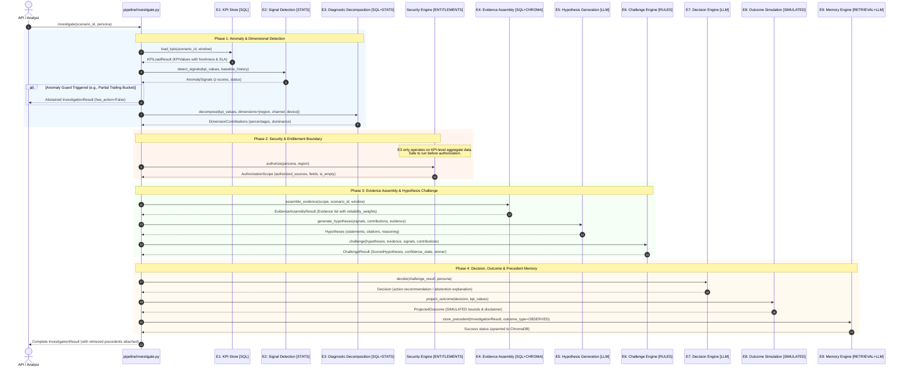

# System Architecture & Data Flow

This document details the architectural design, control flow, inter-engine communication, pluggable LLM provider layer, and telemetry infrastructure of **BusinessIntelligence.ai**.

---

## 1. End-to-End System Data Flow

The investigation pipeline follows a unidirectional execution path orchestrated by `pipeline/investigate.py`. The diagram below illustrates how raw telemetry from operational data stores is transformed into decision intelligence.



> [!NOTE]
> Precedent storage is part of the active investigation path (Phase 4). Precedent retrieval is implemented by E9 and executed by the orchestrator at the start of the run, but the retrieved precedents are not currently injected into the active investigation loop (they do not inform E5 or E7 context).

---

## 2. The Orchestrator (`pipeline/investigate.py`)

The `investigate()` function is the central entry point. It manages state transitions, dependency injection, and error boundaries.

### Dependency Container
External state is encapsulated within the `Dependencies` dataclass:
```python
@dataclass
class Dependencies:
    db_conn: Optional[Any] = None               # PostgreSQL connection
    chroma_client: Optional[Any] = None         # ChromaDB client
    llm_provider: Optional[LLMProvider] = None  # Ollama / Groq LLM provider
    security_engine: Optional[SecurityEngine] = None
    source_registry: Optional[SourceRegistry] = None
    telemetry_service: Optional[TelemetryService] = None
    window_start: Optional[datetime] = None     # Optional analysis start
    window_end: Optional[datetime] = None       # Optional analysis end
```

### Pluggable LLM Provider Layer
Engines interact with language models exclusively via the `LLMProvider` abstraction (`llm/provider.py`):
- `OllamaProvider`: Default local inference provider (`qwen3:8b`, `gemma3:12b`, `bge-m3`).
- `GroqProvider`: Hosted low-latency cloud inference provider (`llama-3.3-70b-versatile`) with bounded exponential backoff for HTTP 429 rate limits and 5xx errors.
- Embedding requests (`embed()`) are delegated to the local `bge-m3` embedder under both providers to maintain 100% ChromaDB compatibility.

---

## 3. Telemetry & Observability (`pipeline/telemetry.py`)

Every engine invocation emits structured metrics into `TelemetryService`:
- **Wall-clock latency** per engine (`duration_ms`).
- **Token consumption** (`prompt_tokens`, `completion_tokens`) for LLM-backed engines (E4 summarization, E5, E7, E9).
- **External Cost Calculation**: Computes real API costs for cloud providers (Groq) and reports $0.00 for local Ollama runs.
- **Execution tracing** attached directly to the `InvestigationResult.telemetry` payload.

---

## 4. API & Frontend Presentation Layer

### REST API (`api/main.py`)
Built on FastAPI, exposing:
- `POST /investigate`: Runs full end-to-end investigation for a requested `scenario_id` and `persona`. Enforces HTTP 403 when persona lacks foundational entitlements.
- `POST /feedback`: Captures human analyst evaluations and validation stamps.
- `GET /health`: Reports database connectivity, ChromaDB status, and active LLM backend (`ollama` or `groq`).

### Interactive Console (`frontend/app.py` & React UI)
A rich user interface providing:
- **Real-Time Scenario Investigation**: Select any scenario (`INC_001`–`INC_008`) and persona (`analyst`, `manager`, `cfo`).
- **Evidence Explorer**: Inspect raw SQL evidence, ChromaDB snippets, and reliability weights.
- **Rule Verification Table**: Visual breakdown of the 5 operational rule checks.
- **Precedent Memory Viewer**: Inspect semantic matches retrieved from ChromaDB with confidence weighting.

---

## 5. Ten Strict Architecture Invariants

1. **Deterministic Numbers**: LLMs never compute z-scores, KPI numbers, rule verdicts, or confidence scores. Quantitative calculations are deterministic conditional on the structured outputs provided to the deterministic engines.
2. **Pre-Retrieval Authorization**: Authorization scopes are resolved *before* querying SQL or vector databases. (Provides filter-based isolation, not physical vector-index isolation).
3. **Fail-Closed Security**: Missing/corrupt entitlement configuration or unknown personas resolve to an empty scope.
4. **Memory Boundary**: Precedent memory (`investigation_precedents`) is never accessible as raw evidence for E4.
5. **Observed vs. Simulated Segregation**: Simulated outcome projections (`outcome_type="simulated"`) and unverified legacy records are excluded from normal observed precedent retrieval.
6. **Immutable Confidence Memory**: Precedent records preserve their original confidence states and are never overwritten upon retrieval.
7. **Citation Fidelity**: Hypotheses citing non-existent evidence IDs (phantom IDs) or altering quoted summaries are disqualified.
8. **Deterministic Abstention**: If top hypothesis confidence is `ABSTAIN` or the score gap between top hypotheses is `< 0.15`, the decision engine is suppressed and produces zero recommended actions.
9. **Single Ground Truth Chokepoint**: `_GROUND_TRUTH_LOAD_ALLOWED = True` is declared exclusively in `evaluation/evaluator.py`. No engine code imports ground truth.
10. **Dynamic Evaluator Extensibility**: The evaluation framework contains zero hardcoded scenario dispatching; all validation dimensions are dynamically discovered.
11. **Shared Institutional Precedents & Authoritative Preservation**: Engine E9 maintains a single shared institutional precedent record per incident scenario (`scenario_id`). Precedents represent full ground-truth operational history evaluated under the Analyst cross-domain scope. Restricted role runs (CFO/Manager) do not create separate persona-siloed precedents or overwrite/degrade existing authoritative Analyst precedents. Entitlement isolation is enforced at query retrieval time ($\text{source\_ids} \subseteq \text{authorized\_sources}$).

---

## 6. Failure Modes & Degradation Handling

| Failure Scenario | Engine Impact | System Behavior |
|---|---|---|
| **PostgreSQL Unavailable** | E1, E3, E4 | E1 fails gracefully; E4 continues with available vector evidence or returns empty set; pipeline abstains due to insufficient data. |
| **ChromaDB Unavailable** | E4, E9 | E4 falls back to SQL-only evidence; E9 queues precedents in an in-memory retry queue (`_pending`) for up to 3 attempts. |
| **Ollama Primary Model Timeout** | E5, E7, E9 | `OllamaProvider` automatically falls back to secondary model (`gemma3:12b`); if fallback also times out, raises `LLMUnavailableError`. |
| **Groq Rate Limit (HTTP 429)** | E5, E7, E9 | `GroqProvider` reads `Retry-After` / reset headers and applies bounded exponential backoff up to `GROQ_MAX_RETRIES`. |
| **LLM Outage (Complete)** | E5, E7, E9 | E5 generates zero hypotheses; E6/E7 abstain; E9 uses deterministic template fallback (`_build_fallback_summary`). |
| **Unauthorized / Unknown Persona** | Security Engine | Scope produces `is_empty=True`; E4 retrieves zero evidence; E7 returns HTTP 403 / Abstain with empty action. |
| **Missing SLA Metadata in Source Registry** | E4 | `reliability_weight` decays to `0.0`; evidence is included with zero weight and logged in `reliability_notes`. |
