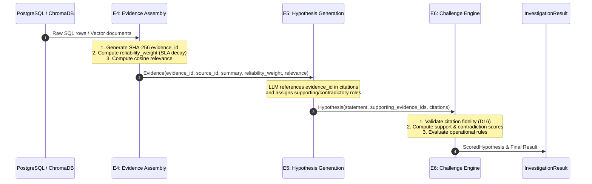

# Data Lifecycle & Provenance Model

This document outlines the data storage architecture, evidence lifecycle, cryptographic identifier generation, MethodTag taxonomy, and citation verification mechanisms of **BusinessIntelligence.ai**.

---

## 1. Storage Architecture

The system utilizes a hybrid storage architecture combining a relational SQL database with an embedded vector store.

```mermaid
flowchart LR
    subgraph PostgreSQL ["PostgreSQL Relational DB (port 5432)"]
        KP[kpi_values]
        PE[payment_events]
        IE[inventory_events]
        DL[deployment_log]
        ST[support_tickets]
    end

    subgraph ChromaDB ["ChromaDB Vector Store (port 8000)"]
        C_ST[support_tickets]
        C_RN[release_notes]
        C_DL[deployment_log]
        C_IP[investigation_precedents\n(E9 Memory)]
    end

    subgraph Pipeline ["Investigation Pipeline"]
        E1[E1: KPI Store] --> KP
        E4[E4: Evidence Assembly] --> PE & IE & DL & ST & C_ST & C_RN & C_DL
        E9[E9: Precedent Memory] <--> C_IP
    end
```

### PostgreSQL Schema Summary (`etl/schema.sql`)
- `kpi_values`: Time series metrics (`kpi_id`, `timestamp`, `value`, `dimensions`).
- `payment_events`: Transaction logs (`event_id`, `timestamp`, `gateway`, `status`, `error_code`, `device`).
- `inventory_events`: Stock changes (`sku_id`, `warehouse_id`, `quantity_delta`, `timestamp`).
- `deployment_log`: Release audit trail (`service_name`, `version`, `deployed_at`, `status`, `commit_hash`).
- `support_tickets`: Customer ticket metadata (`ticket_id`, `category`, `created_at`, `summary`).

### ChromaDB Collections (bge-m3 1024-dim Embeddings)
- `support_tickets`: Unstructured customer issue descriptions and transcripts.
- `release_notes`: Changelogs and patch notes for software services.
- `deployment_log`: Extended deployment changelogs and commit diffs.
- `investigation_precedents`: Historical investigation records (owned exclusively by Engine E9).

---

## 2. Provenance Taxonomy (`MethodTag`)

Every piece of data, evidence item, and intermediate engine output is stamped with an explicit `MethodTag` (`models.py`):

| MethodTag | Meaning / Guarantee | Allowed Operations |
|---|---|---|
| **`SQL`** | Query-level relational extraction from PostgreSQL. | Raw values, aggregation, filtering |
| **`STATS`** | Deterministic statistical computation (scipy / math). | Z-scores, standard deviations, deltas |
| **`ETL`** | Pre-computed batch metrics or pipeline ingest. | Data transformation, loading |
| **`RULES`** | Deterministic rule verification and challenge scoring. | Logic verdicts, mathematical weights |
| **`RETRIEVAL`** | Semantic vector search from ChromaDB with distance mapping. | Vector similarity, relevance scores |
| **`LLM`** | Pure natural-language narrative generation. | Hypothesis statements, reasoning, actions |
| **`LLM_NARRATIVE`** | LLM-generated narrative wrapper around deterministic numbers. | Explanatory text |
| **`RULES+LLM_NARRATIVE`** | Hybrid challenge verdict with LLM explanation. | Operational audit trails |
| **`SIMULATED`** | Algorithmic outcome projection model (not empirical fact). | Scenario simulation curves |

---

## 3. Evidence Lifecycle



---

## 4. Deterministic Evidence Identifiers

Evidence IDs are constructed using deterministic SHA-256 hashing to guarantee stable cross-scenario traceability:
```python
def _make_evidence_id(prefix: str, scenario_id: str, suffix: str) -> str:
    raw = f"{prefix}:{scenario_id}:{suffix}"
    return hashlib.sha256(raw.encode()).hexdigest()[:16]
```
Example ID: `f7a28b109c34e021` (Prefix: `sql_payment`, Scenario: `INC_001`, Suffix: `error_rate`).

---

## 5. Freshness & Reliability Weighting

Engine E4 dynamically calculates the reliability weight ($W_{\text{rel}} \in [0, 1]$) of every evidence item based on data quality ratings and staleness relative to its SLA:

$$W_{\text{rel}} = 
\begin{cases} 
0.0 & \text{if } \text{sla\_minutes} = 0 \text{ or } \text{freshness} = \text{UNKNOWN} \\
Q_{\text{data}} & \text{if } \text{staleness} \le \text{sla\_minutes} \\
Q_{\text{data}} \times \max\left(0, 1 - \frac{\text{staleness} - \text{sla}}{\text{sla}}\right) & \text{if } \text{staleness} > \text{sla\_minutes}
\end{cases}$$

Where $Q_{\text{data}} \in [0, 1]$ is the source quality rating from `config/sources.yaml`.

---

## 6. Citation Fidelity & Verification (Dimension 16)

Engine E6 executes `validate_citations()` on every hypothesis before scoring:

```python
def validate_citations(hypothesis: Hypothesis, evidence_by_id: dict[str, Evidence]) -> list[CitationViolation]:
    violations = []
    seen_ids = set()
    for citation in hypothesis.citations:
        # Rule 1: No duplicate citations
        if citation.evidence_id in seen_ids:
            violations.append(CitationViolation(citation.evidence_id, "duplicate_citation"))
        seen_ids.add(citation.evidence_id)

        # Rule 2: Evidence ID must exist in E4 set (No phantom IDs)
        if citation.evidence_id not in evidence_by_id:
            violations.append(CitationViolation(citation.evidence_id, "phantom_id"))
            continue

        # Rule 3: Quoted summary must match actual evidence under punctuation/case normalization
        actual = evidence_by_id[citation.evidence_id].summary
        if normalize(citation.quoted_summary) != normalize(actual):
            violations.append(CitationViolation(citation.evidence_id, "summary_mismatch"))
            
    return violations
```

If any citation violation occurs, the hypothesis is immediately **disqualified** (`final_score=0.0`, `confidence=ABSTAIN`). 

> [!NOTE]
> Formatting and whitespace drift is normalized away via canonicalization, so minor text drifts are not fatal. Material quote mismatches, duplicate citations, and phantom IDs are fatal and cause immediate disqualification.
