# Evaluation Framework & Scorecard Reference

This document details the architecture, 16-dimension scorecard, dynamic scenario discovery, held-out evaluation, adversarial perturbation testing, and calibration reporting of **BusinessIntelligence.ai**.

---

## 1. Evaluator Architecture (`evaluation/evaluator.py`)

The evaluation engine acts as an objective, decoupled test harness that scores an `InvestigationResult` against predefined expectations in `data/ground_truth.json`.

```mermaid
flowchart TD
    subgraph Ground_Truth ["data/ground_truth.json"]
        GT[Ground Truth Scenarios\nINC_001 – INC_008]
    end

    subgraph Evaluator_Core ["evaluation/evaluator.py"]
        LOAD[Dynamic Scenario Discovery\n& Schema Validation]
        D1[D01: Anomaly Detected]
        D2[D02: Drivers Represented]
        D3[D03: Direction Correct]
        D4[D04: Dominant Contributor]
        D5[D05: Evidence Freshness & SLA]
        D6[D06: Competing Hypotheses >= 2]
        D7[D07: Winning Hypothesis & Conf]
        D8[D08: Deterministic Scoring Math]
        D9[D09: Recommended Action Grounding]
        D10[D10: Abstention Correctness]
        D11[D11: Telemetry Recorded]
        D12[D12: Memory Precedent Stored]
        D13[D13: Provenance Method Tags]
        D14[D14: Zero Hallucinated IDs]
        D15[D15: Zero Auth Violations]
        D16[D16: Citation Fidelity]
    end

    GT --> LOAD
    LOAD --> D1 & D2 & D3 & D4 & D5 & D6 & D7 & D8 & D9 & D10 & D11 & D12 & D13 & D14 & D15 & D16
    
    IR[InvestigationResult from Pipeline] --> D1 & D2 & D3 & D4 & D5 & D6 & D7 & D8 & D9 & D10 & D11 & D12 & D13 & D14 & D15 & D16
```



### The Isolation Guard
To guarantee that the pipeline never overfits by reading ground truth during execution, `_GROUND_TRUTH_LOAD_ALLOWED = True` is declared **exclusively** within `evaluation/evaluator.py`. All other modules in `engines/`, `pipeline/`, `security/`, and `etl/` set `_GROUND_TRUTH_LOAD_ALLOWED = False`.

---

## 2. The 16 Evaluation Dimensions

The evaluator defines a vocabulary of 16 potential evaluation dimensions. A scenario's `ground_truth` schema activates the relevant checks for its specific context. Therefore, individual scenarios may report fewer than 16 dimensions in their final scorecard. D13–D16 remain mandatory hard security/integrity checks for all scenarios.

| Dimension | Name | Core Verification Rule |
|---|---|---|
| **D01** | Anomaly Detected | `result.anomaly_detected == expected.anomaly_detected` |
| **D02** | Root Drivers Represented | Checks that anomalous KPI signals contain required driver metrics. |
| **D03** | Directional Delta Correct | Verifies that metric change direction matches observed sign. |
| **D04** | Dominant Contributor | Identifies expected dominant segment (e.g. `Android` in INC_001). |
| **D05** | Evidence Freshness Weight | Verifies all evidence items have valid `[0, 1]` reliability weights. |
| **D06** | Competing Hypotheses | Requires $\ge 2$ valid competing hypotheses in un-abstained runs. |
| **D07** | Winning Hypothesis & Confidence | Verifies winner ID and confidence match ground-truth state. |
| **D08** | Deterministic Scoring | Asserts that scores match mathematical pure function calculations. |
| **D09** | Action Grounding | Verifies recommendation addresses root cause and cites evidence. |
| **D10** | Abstention Correctness | Enforces abstention when anomalies are uncorroborated or score gap $< 0.15$. |
| **D11** | Telemetry Recorded | Asserts wall-clock duration and token metrics exist. |
| **D12** | Memory Precedent Stored | Confirms precedent is indexed in ChromaDB collection. |
| **D13** | Provenance Correctness | All evidence method tags $\in \{\text{SQL}, \text{RETRIEVAL}, \text{ETL}\}$. |
| **D14** | Zero Hallucinated IDs | Asserts 0 cited evidence IDs outside the E4 evidence set. |
| **D15** | Zero Auth Violations | Asserts 0 evidence items outside the persona's entitlement scope. |
| **D16** | Citation Fidelity | Asserts quoted citation summaries match authoritative evidence text. |

---

## 3. Dynamic Discovery & Schema Validation (ISSUE-004 Phase 5)

The evaluator dynamically iterates through all scenarios declared under the `scenarios` key in `data/ground_truth.json`.

### Schema Validation Rules
Before evaluating a scenario, `Evaluator` validates:
1. **Required Structure**: Each scenario must define `scenario_id`, `description`, and `evaluation_checks`.
2. **Required Checks**: `evaluation_checks` must contain `anomaly_detected` and `abstain_expected`.
3. **Strict Check Set**: Rejects unknown evaluation check fields with explicit `ValueError` diagnostics rather than silently ignoring unvalidated keys.

---

## 4. Held-Out Evaluation Scenarios

The suite includes four held-out scenarios designed to test generalization on edge-case topologies:

### `INC_005` — Trailing Bucket Anomaly Guard
- **Challenge**: An incomplete trailing hourly window shows a sudden conversion drop, but leading indicators (payment failure rate, latency) are normal.
- **Expected Outcome**: `anomaly_detected=False`, `abstained=True`, `hypothesis_count=0`, `has_action=False`.
- **Status**: **8/8 Dimensions Passed**.

### `INC_006` — Compound-Cause Checkout Starvation
- **Challenge**: Database connection pool exhaustion caused by concurrent service release and retry storm.
- **Expected Outcome**: `anomaly_detected=True`, `winner=H1`, `confidence=HIGH`, $\ge 2$ compound hypotheses.
- **Status**: **8/8 Dimensions Passed**.

### `INC_007` — Gradual Memory Leak Degradation
- **Challenge**: Slow memory leak in payment gateway worker processes causing latency degradation over 12 hours.
- **Expected Outcome**: `anomaly_detected=True`, `winner=H1`, `confidence=HIGH`.
- **Status**: **7/7 Dimensions Passed**.

---

## 5. Cross-Domain Generalization (`INC_008`)

To verify that the pipeline does not rely on hardcoded e-commerce assumptions, `INC_008` introduces a completely different business domain:

- **Domain**: B2B Subscription SaaS Analytics.
- **Key Metrics**: `hourly_conversion`, `enterprise_sso_failure_rate`.
- **Entities & Segments**: Enterprise subscription tiers, SAML SSO authentication endpoints, Okta token parsing logs.
- **Root Cause**: Regression in `sso-auth-service v2.4.0` breaking SAML assertion decoding for Enterprise customers.
- **Status**: **7/7 Dimensions Passed** through the live, un-mocked pipeline.

---

## 6. Adversarial Perturbation & Monotonicity Testing

Validated in `tests/test_overfitting.py`:
- **Evidence Deletion / Scrambling**: Deleting supporting evidence monotonically decreases a hypothesis's score; injecting high-reliability contradictory evidence reduces score to refutation ($< 0.30$).
- **Phantom ID Injection**: Adding fake evidence IDs triggers citation validation penalties and disqualifies hypotheses.
- **Entitlement Corruption**: Tampering with persona entitlement scopes causes immediate fail-closed pipeline abstention.

---

## 7. Confidence Label Agreement Reporting (`CalibrationReporter`)

The `CalibrationReporter` class in `evaluation/evaluator.py` tallies predicted confidence states against ground truth outcomes across evaluation runs to measure **confidence label agreement**:

```
==================================================
BusinessIntelligence.ai — Confidence Label Agreement Report
==================================================
Total Scenarios Evaluated: 8

Confidence Label Agreement (Predicted vs Expected Correctness):
--------------------------------------------------
  HIGH    : 5/5 agreement (100.0%)
  MEDIUM  : 0 predictions
  LOW     : 0 predictions
  ABSTAIN : 3/3 agreement (100.0%)

NOTE: These metrics represent label agreement, not true statistical
calibration. Statistical calibration requires a larger dataset (N >= 30)
and appropriate calibration metrics. Do not tune thresholds based on
the current small dataset.
==================================================
```

### What the Evaluator Proves vs. Does Not Prove

**What the Evaluator Proves (Measured & Validated)**:
- 100% compliance with structural and architectural invariants.
- 0 hallucinated evidence IDs and 0 entitlement boundary violations.
- Deterministic scoring alignment with pure mathematical formulas.
- Generalization across held-out topologies and cross-domain schemas.

**What the Evaluator Does Not Prove (Current Limitations)**:
- **Statistical Calibration**: An evaluation set of $N=8$ is exploratory. True statistical confidence calibration requires $N \ge 30$ and formal calibration metrics; the current report only shows confidence label agreement.
- **Deep Domain Semantic Validity**: Passing all dimensions proves that citations match and scores are mathematically correct; verifying whether the LLM's natural language prose makes sound business sense in novel domains still requires human domain expert review.

---

## 8. Continuous Evaluation & Operational Drift Monitoring (v1)

The Continuous Evaluation layer (`evaluation/health.py` and `GET /evaluation/health`) provides on-demand operational health and drift observability across production investigation runs.

### 8.1 The Six Core Health Metrics

| Metric | Source Field / Table | Formula | Watch Threshold | Degraded Threshold |
| :--- | :--- | :--- | :--- | :--- |
| **E2E Latency ($p_{95}$)** | `investigations.result_json->'telemetry'` | $p_{95}(\sum \text{latencies})$ | $+2,000\text{ms}$ ($+2.0\text{s}$) or $+50\%$ | $+5,000\text{ms}$ ($+5.0\text{s}$) or $+100\%$ |
| **Abstention Rate** | `investigations.result_json->'decision'` | $\text{Count}(\text{abstained}=\text{True}) / N$ | $|\Delta| \ge 0.15$ ($15\text{ pts}$) | $|\Delta| \ge 0.30$ ($30\text{ pts}$) |
| **HIGH-Confidence Rate** | `investigations.result_json->'scored'` | $\text{Count}(\text{winning}=\text{HIGH}) / N$ | $\Delta \le -0.15$ ($15\text{ pt}$ drop) | $\Delta \le -0.30$ ($30\text{ pt}$ drop) |
| **Human Agreement Rate** | `feedback.verdict` | $\frac{\text{CORRECT}}{\text{CORRECT} + \text{INCORRECT}}$ | $\Delta \le -0.15$ ($15\text{ pt}$ drop) | $\Delta \le -0.30$ ($30\text{ pt}$ drop) |
| **Citation Violation Rate** | `investigations.result_json->'scored'` | $\text{Count}(\ge 1 \text{ violation}) / N$ | $|\Delta| \ge 0.05$ ($5\%$) | $|\Delta| \ge 0.10$ ($10\%$) |
| **E9 Precedent Relevance** | `investigations.result_json->'precedents'` | $\text{Avg}(\text{relevance})$ over runs with $\ge 1$ prec | $\Delta \le -0.05$ | $\Delta \le -0.10$ |

### 8.2 Count-Based Windowing & Cold-Start Lifecycle
* **Window Size**: 50 recent runs vs 50 baseline runs immediately preceding.
* **$0 \le N \le 19$ (`INSUFFICIENT_DATA`)**: No drift evaluated; returns insufficient data status.
* **$20 \le N \le 49$ (`RECENT_ONLY`)**: Computes recent metric summary; baseline comparison is omitted.
* **$50 \le N \le 99$ (`PARTIAL_BASELINE`)**: Recent 50 runs compared against earlier $N-50$ runs with limited confidence.
* **$N \ge 100$ (`FULL_COMPARISON`)**: Full 50-vs-50 comparison.

### 8.3 Operational Monitoring vs. Statistical Significance
> [!IMPORTANT]
> **Operational Monitoring Invariant**: Thresholds are **operational monitoring rules**, NOT statistical hypothesis tests. No p-values or parametric assumptions are claimed. Furthermore, the monitoring system is **purely observational**: it **never** automatically modifies scoring thresholds, prompts, ground truth, scoring weights, or entitlements.

