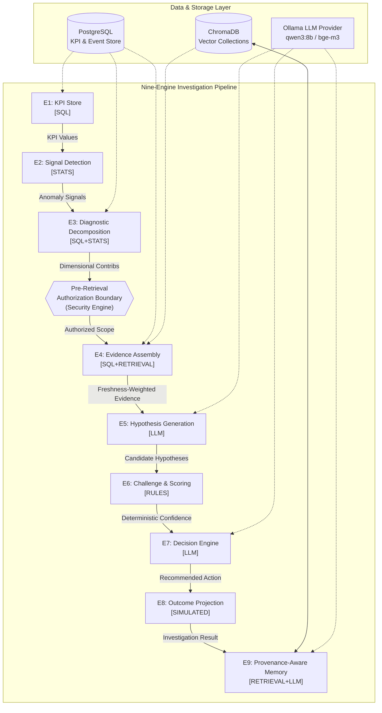

# BusinessIntelligence.ai — Master Technical Overview

**BusinessIntelligence.ai** is an evidence-backed KPI anomaly investigation engine designed for enterprise operations. It autonomously detects anomalies in critical business metrics, isolates dimensional drivers, queries authorized multi-modal evidence (structured SQL and vector-indexed unstructured text), generates competing hypotheses, challenges them against deterministic operational rules, and produces confidence-calibrated decision recommendations.

---

## 1. System Philosophy: Separation of Truth and Narrative

The core architectural invariant of BusinessIntelligence.ai is the **strict separation between quantitative truth and natural-language narrative**:

```
Quantitative Truth (Numbers, Z-Scores, Scores, Decisions)
   ↳ Strictly computed by deterministic engines [SQL, STATS, RULES]
   ↳ Pure functions with zero floating randomness or LLM hallucination risk

Narrative Synthesis (Summaries, Explanations, Hypotheses)
   ↳ Generated by Language Models [LLM, LLM_NARRATIVE]
   ↳ Constrained by strict JSON schemas, prompt isolation, and citation validators
```

Large Language Models (LLMs) in BusinessIntelligence.ai are never permitted to compute KPI movements, calculate z-scores, evaluate rule verifications, score hypotheses, or establish final confidence levels. Quantitative scoring and decision logic are deterministic conditional on the structured outputs provided to the deterministic engines. LLM generation itself (e.g., hypothesis formulation, narrative synthesis) is not claimed to be bit-for-bit deterministic, even with temperature=0.

---

## 2. High-Level Architecture Pipeline

The system is organized into a sequential nine-engine pipeline (`E1` through `E9`) orchestrated by `pipeline/investigate.py`, with an enforced **pre-retrieval authorization boundary** positioned between diagnostic decomposition and evidence assembly.



---

## 3. Core Engine Summary

| Engine | Provenance Tag | Primary Responsibility | Deterministic vs LLM |
|---|---|---|---|
| **E1 KPI Store** | `SQL` | Loads connected KPI time series and computes freshness. | **100% Deterministic SQL** |
| **E2 Signal Detection** | `STATS` | Detects statistically significant anomalies via z-score and corroboration guards. | **100% Deterministic Stats** |
| **E3 Diagnostic** | `SQL+STATS` | Decomposes KPI anomalies across dimensions (region, channel, device). | **100% Deterministic SQL+Stats** |
| **E4 Evidence** | `SQL+RETRIEVAL` | Queries authorized SQL tables and ChromaDB vector collections; weights by freshness SLA. | **100% Deterministic Retrieval** (Optional LLM 1-sentence compression) |
| **E5 Hypothesis** | `LLM` | Generates competing causal explanations grounded in the KPI driver space. | **LLM Narrative Generation** (Schema-validated) |
| **E6 Challenge** | `RULES` | Evaluates 5 operational rules and deterministically scores hypotheses. | **100% Deterministic Rule Math** (Zero LLM score influence) |
| **E7 Decision** | `LLM` | Produces actionable recommendations; enforces strict abstention if confidence is low. | **LLM Narrative** (Bound by deterministic confidence) |
| **E8 Outcome** | `SIMULATED` | Simulates post-action metric recovery under strict simulation labels. | **Deterministic Simulation Model** |
| **E9 Memory** | `RETRIEVAL+LLM` | Stores precedent cases in ChromaDB with full provenance. (Precedent retrieval is implemented and occurs pre-run, but is not currently injected into the active investigation loop). | **Hybrid Vector Retrieval + LLM Summary** |

---

## 4. Key Engineering Pillars

### Pillar 1: Authorization Before Retrieval
Traditional RAG pipelines retrieve data from vector stores and databases first, then attempt to filter or instruct the LLM to ignore sensitive data. BusinessIntelligence.ai enforces a **fail-closed pre-retrieval authorization boundary** (`security/entitlements.py`). Persona scopes are resolved *before* querying PostgreSQL or ChromaDB. Unauthorized tables and vector collections are never queried, ensuring that unauthorized data never enters memory or LLM context prompts.

### Pillar 2: Provenance-Aware Memory
Past investigation outcomes stored in Engine E9 maintain an immutable provenance chain:
- Stored records preserve their `original_confidence_state`, `scenario_id`, `evidence_ids`, and `outcome_type`.
- Retrieval scores apply strict confidence weighting (`HIGH=1.0`, `MEDIUM=0.6`, `ABSTAIN=0.2`, `LOW=0.1`).
- Human-validated investigations receive an additive relevance boost (`+0.1`).
- Domain-specific TTL expiry (`config/memory_retention.yaml`) prunes stale precedents.
- Simulated and unverified legacy records are strictly segregated from observed operational precedents.

### Pillar 3: Held-Out & Dynamic Evaluation
System correctness is evaluated against a framework of 16 potential evaluation dimensions (`evaluation/evaluator.py`). Ground truth scenarios are dynamically discovered from `data/ground_truth.json` with strict schema validation. (Note: While the evaluator dynamically discovers scenarios, the runtime `investigate()` orchestrator may still use explicit registries for default analysis windows). The suite validates:
- **Held-out scenarios** (`INC_005` partial bucket guard, `INC_006` compound cause, `INC_007` gradual degradation).
- **Cross-domain generalization** (`INC_008` B2B SaaS SAML SSO outage).
- **Adversarial perturbation testing** to ensure scoring monotonicity and hallucination rejection.

---

## 5. Measured System Verification

The following verified metrics represent the current state of the repository across all test suites, live Docker services, and evaluation pipelines:

```
Automated Test Suite:          243 / 243 PASSED (100%)
Live Held-Out Evaluation:      4 / 4 SCENARIOS PASSED (100%)
Demo Pipeline (INC_001):       16 / 16 DIMENSIONS PASSED (100%)
Authorization Violations:      0
Hallucinated Evidence IDs:     0
Citation Fidelity Violations:  0
Precedent Records Verified:    8 / 8 Provenance-Complete
```

---

## 6. Technical Documentation Sitemap

For in-depth explanations of individual components, refer to the dedicated technical guides:

1. [System Architecture & Data Flow](ARCHITECTURE.md) — Detailed sequence flows, orchestrator design, and failure modes.
2. [Engines E1–E9 Detailed Reference](ENGINES.md) — Comprehensive technical reference for each of the nine engines.
3. [Security & Entitlements Boundary](SECURITY.md) — Pre-retrieval filtering, fail-closed scopes, and isolation mechanics.
4. [Provenance-Aware Precedent Memory](MEMORY.md) — E9 memory lifecycle, retrieval weighting, human validation, and retention.
5. [Evaluation Framework & Scorecards](EVALUATION.md) — 16 scorecard dimension vocabulary, held-out validation, and confidence label agreement.
6. [Data Lifecycle & Provenance Model](DATA_AND_PROVENANCE.md) — PostgreSQL, ChromaDB, MethodTag taxonomy, and citations.
7. [Deterministic vs. LLM Boundaries](LLM_BOUNDARIES.md) — Permitted vs forbidden LLM operations, prompt isolation, and JSON schemas.
8. [Configuration Architecture](CONFIGURATION.md) — Configuration schemas, loaders, and operational impact.
9. [Testing Architecture & Verification](TESTING.md) — Pytest structure, unit/integration/adversarial test suites.
10. [Operations & Deployment Guide](OPERATIONS.md) — Docker setup, ETL ingestion, live CLI, API, and Streamlit execution.
